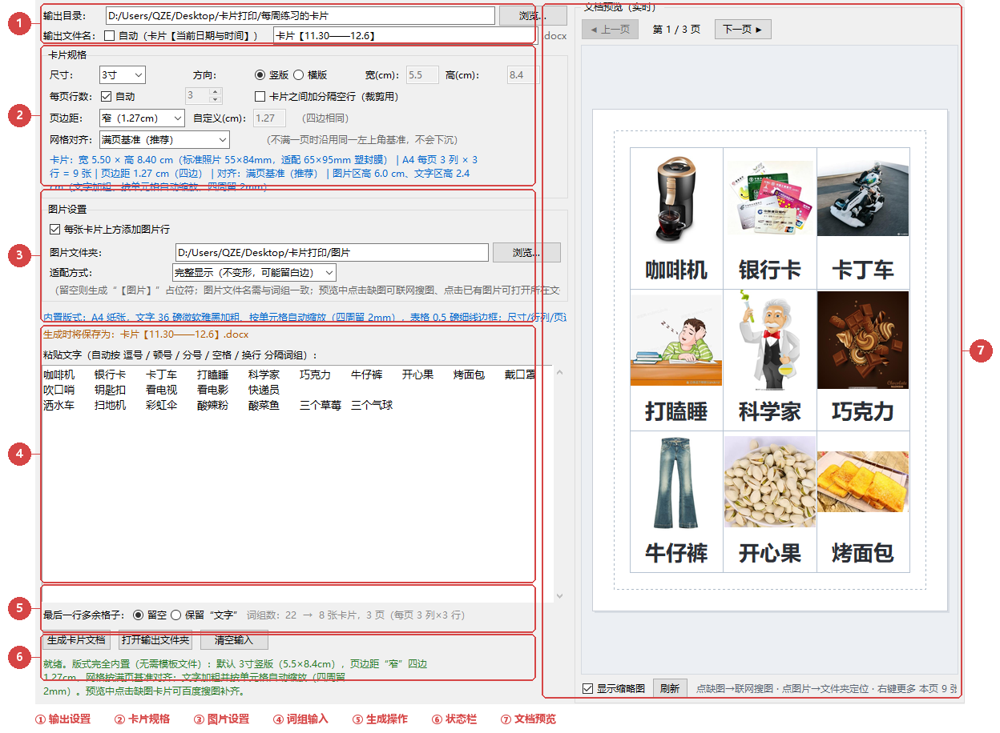

# 卡片批量生成器（Children's Character Recognition Flashcard Layout Tool）


一款面向儿童识字教学的 **图文卡片批量生成工具**：粘贴一段词组，自动拆分、自动排版、自动匹配图片，一键输出为可打印的 Word（.docx）文档。卡片尺寸精确可控，所见即所得。

---

## ✨ 功能特性

### 📝 词组处理
- 粘贴一段文字，自动按分隔符（`，` `,` `、` 空格 换行 `;` `；`）拆分为词组
- 需要几张卡片就生成几行，数量不限

### 📐 卡片规格
- 内置国家标准照片尺寸：**3寸 / 4寸 / 5寸 / 6寸**，横版 / 竖版可选，也支持**自定义宽高**

| 规格 | 竖版尺寸（宽 × 高） | 说明 |
|------|--------------------|------|
| 3寸 | 5.5 × 8.4 cm | 默认规格 |
| 4寸 | 7.6 × 10.2 cm | 标准照片 |
| 5寸 | 8.9 × 12.7 cm | 3R |
| 6寸 | 10.2 × 15.2 cm | 4R |

- 每页行列数根据卡片尺寸在 A4 纸上自动计算，也可手动指定每页行数
- 页边距可选（窄 / 适中 / 常规 / 宽 / 自定义）
- 网格对齐"满页基准"：卡片不满一页时网格不居中、不下沉，版面稳定

### 🔤 文字自适应
- 内置微软雅黑加粗字体，按单元格大小**自动收缩字号**
- 文字四周各预留 2mm 安全边距，词组越长字号越小，保证不溢出、不被裁切、不出现临界换行
- 文字在卡片内水平、垂直居中，与预览完全一致

### 🖼️ 图片匹配
- 按词组文件名自动匹配图片并嵌入卡片
- 三种适配模式：**拉伸填充**（铺满不留白）/ **铺满裁剪**（不变形居中裁切）/ **完整显示**（不变形可能留白）

### 🔍 百度搜图补图
- 预览中单击缺失图片的卡片，弹出搜索窗口按词组**联网搜索百度图片**
- 首屏一次加载 60 张，"加载更多"可持续翻页至数百张，自动去重
- 单击选中、双击确认，图片自动转存为 `词组.jpg` 到图片文件夹并立即刷新预览

### 📂 图片管理
- 单击已有图片的卡片，直接打开图片所在文件夹并选中该文件
- 右键菜单：在文件夹中显示 / 用默认看图程序打开 / 更换图片（百度搜图）/ 从本地文件更换
- 替换文件夹中的图片后，点"刷新"重新载入缩略图

### 👁️ 实时预览
- 按真实排版比例绘制页面缩略图（纸张、页边距、网格锚点、每张卡片的图片与文字）
- 多页可翻页查看，改动参数即时刷新

### 📦 零依赖开箱即用
- 版式完全内置：纸张、表格边框、单元格边距、字体全部由程序按规格自动计算生成，**不再需要任何模板文件**，不存在"模板丢失/路径失效"的问题
- 核心功能仅使用 Python 标准库，生成纯标准 OOXML 文档

---

## 🖥️ 界面说明

程序为左右两栏布局：左侧是参数设置与词组输入，右侧是文档实时预览。



| 编号 | 区域 | 作用 |
|:---:|------|------|
| ① | 输出设置 | 选择文档保存位置，设置输出文件名（自动命名或自定义，支持 {日期}{时间} 占位符） |
| ② | 卡片规格 | 卡片尺寸（3/4/5/6寸/自定义）、横竖版方向、每页行数、分隔空行、页边距、网格对齐 |
| ③ | 图片设置 | 是否添加图片行、图片文件夹（按词组名自动匹配图片）、图片适配方式 |
| ④ | 词组输入 | 粘贴词组文字，自动按分隔符拆分并实时统计卡片数与页数 |
| ⑤ | 生成操作 | 最后一行多余格子的处理方式（留空 / 保留"文字"）；生成、打开输出文件夹、清空按钮 |
| ⑥ | 状态栏 | 显示就绪状态、生成结果与搜图等操作反馈 |
| ⑦ | 文档预览 | 按真实排版绘制页面缩略图，可翻页；单击缺图联网搜图、单击已有图定位文件夹、右键更多操作 |

> 详细的图文操作步骤见 [使用教程](卡片批量生成器V6.1.0.0使用教程.pdf)。

---

## 🚀 快速开始

### 方式一：下载打包版（推荐）

1. 前往 [Releases](../../releases) 页面，下载 `卡片批量生成器V6.1.0.0.rar`
2. 解压到任意目录
3. 双击 `卡片批量生成器.exe` 运行，无需安装 Python

### 方式二：从源码运行

```bash
# 克隆仓库
git clone https://github.com/JerryQu414/Childrens-Character-Recognition-Flashcard-Layout-Tool.git
cd Childrens-Character-Recognition-Flashcard-Layout-Tool

# 运行（需 Python 3.12+，可选安装 Pillow 以显示预览缩略图）
python 卡片批量生成器.py
```

> 💡 Pillow 为可选依赖：未安装时程序一切功能照常，仅预览的图片区显示为占位框。

### 基本使用流程

1. 在词组输入框粘贴文字（如：`苹果 香蕉 西瓜 葡萄`）
2. 选择卡片规格、每页行数、页边距、图片适配模式
3. 在右侧预览中检查排版，单击缺失图片的卡片可联网搜图补图
4. 设置输出文件名，点击生成，得到 .docx 文件后直接打印

---

## 🛠️ 从源码打包

使用 PyInstaller 打包为独立 EXE：

```bash
pip install pyinstaller pillow

pyinstaller --noconfirm --clean ^
  --name 卡片批量生成器 ^
  --windowed --onedir ^
  --add-data "卡片版式模板.docx;." ^
  --version-file version_info.txt ^
  --exclude-module numpy ^
  卡片批量生成器.py
```

---

## 📋 更新日志

### v6.1.0.0
- 🐛 **修复输出 docx 文件损坏的问题**：自建包主文档关系命名空间写错导致 Word 判定文件损坏，已修复并通过 Word 实测（段落/表格/内嵌图完整无误）
- ✨ 版式模板文件打包进程序内部，不再依赖外部模板文件

### v6.0.x
- 去除外部模板依赖，版式由程序全自动计算生成
- 文字边距调整为 2mm，消除 4 字词的临界换行

### v5.x
- 新增百度搜图补图、搜索结果"加载更多"翻页
- 新增点击已有图片定位文件夹、右键菜单更换图片
- 界面紧凑化，适配小屏幕

---

## ❓ 常见问题

**Q：生成的文档用 Word 打不开/提示损坏？**
请升级到 v6.1.0.0，该版本已彻底修复。v6.0.x 生成的损坏文件无法修复，请用新版本重新生成。

**Q：预览里的图片显示为空白占位框？**
安装 Pillow 即可显示真实缩略图：`pip install pillow`。

**Q：搜图结果数量有限制吗？**
百度接口单次上限 60 张，可通过"加载更多"持续翻页至数百张，程序会自动去重。

---

## 📄 许可证

Copyright (c) 2026 邱卓尔. 保留所有权利。

本软件按"现状"提供，不对因使用本软件产生的任何直接或间接损失承担责任。
